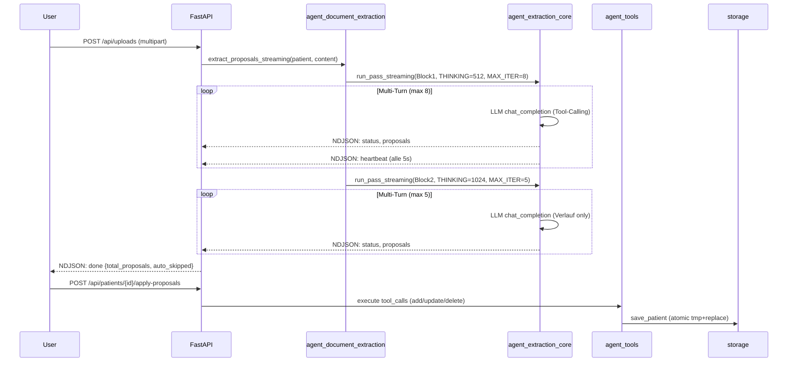
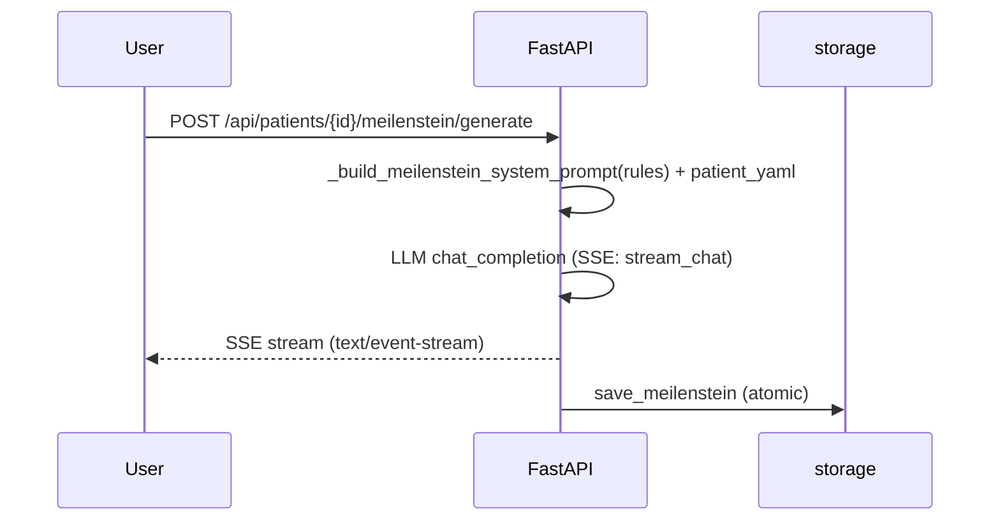
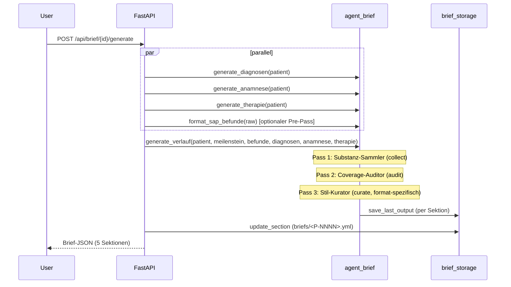
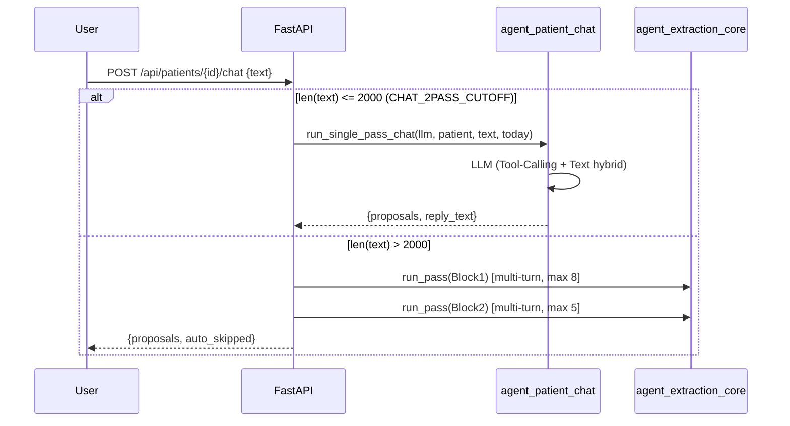

# 01 — Repo-Analyse: arztbrief-app (Stand 2026-05-07)

Grundlage für alle weiteren ICM-Migrationsdokumente.
Keine Produktionsänderungen — rein deskriptiv.

---

## 1. Repo-Map

```
arztbrief-app/
├── Makefile                         # dev / backend / frontend Targets
├── backend/
│   ├── main.py                      # FastAPI-App, alle Endpunkte (1563 Zeilen)
│   ├── llm_client.py                # OpenAI-kompatibler Client, 2 Backends (150 Z.)
│   ├── models/
│   │   └── patient.py               # Pydantic-Patientenmodell (schema_version 0.4)
│   ├── storage.py                   # Alt-Brief-System + Patient/Meilenstein-Persistenz (190 Z.)
│   ├── brief_storage.py             # Neu-Brief-System (89 Z.)
│   ├── learning_storage.py          # Lernlog-Persistenz (188 Z.)
│   ├── agent_brief.py               # Brief-Generator 3-Pass + Polish (407 Z.)
│   ├── agent_document_extraction.py # 2-Pass-Extraktion + Streaming (312 Z.)
│   ├── agent_extraction_core.py     # Multi-Turn-Tool-Loop (340 Z.)
│   ├── agent_meilenstein_learning.py# Regelextraktion / Konflikt / Rebuild (215 Z.)
│   ├── agent_patient_chat.py        # Chat 1-Pass / 2-Pass (227 Z.)
│   ├── agent_stammdaten_extraction.py# Einzel-Pass JSON-Mode (86 Z.)
│   ├── agent_tools.py               # 13 Tool-Funktionen + 12 Schemas (509 Z.)
│   ├── prompts/                     # 20 Prompt-Dateien (.txt + .md)
│   │   ├── adressaten/
│   │   │   └── normalstation_intern.md
│   │   ├── brief_*.txt              # 13 Brief-Prompts
│   │   ├── extraction_block1.txt
│   │   ├── extraction_block2.txt
│   │   ├── extract_stammdaten.txt
│   │   ├── learning_*.txt           # 3 Lernlog-Prompts
│   │   └── meilenstein_system.txt
│   ├── data/
│   │   ├── patients/    # <P-NNNN>.yml
│   │   ├── meilensteine/# <P-NNNN>.md + .meta.json
│   │   ├── briefe/      # <P-NNNN>.json  (Alt-System)
│   │   ├── briefs/      # <P-NNNN>.yml   (Neu-System)
│   │   ├── chat/        # <P-NNNN>.json
│   │   ├── learnings/   # default/{meilenstein,brief/<section>}/{rules.yml,last/<pid>.txt}
│   │   └── audit/
│   └── tests/
│       ├── conftest.py              # isolated_data-Fixture
│       ├── test_brief.py            # 40+ Tests
│       ├── test_main.py             # 40+ Tests
│       ├── test_agent_document_extraction.py # 23+ Tests
│       ├── test_agent_tools.py
│       ├── test_brief_learning.py
│       ├── test_learning_storage.py
│       ├── test_meilenstein_learning.py
│       └── test_storage.py
└── frontend/
    ├── src/
    │   ├── types.ts                 # Alle Frontend-Typen (gespiegelt aus Python)
    │   ├── api/
    │   │   ├── brief.ts             # Brief + Lernlog API-Client
    │   │   └── chat.ts              # Chat-History API-Client
    │   └── ...                      # React-Komponenten (nicht analysiert)
    └── vite.config.ts (angenommen)
```

**Sprachen / Frameworks:**
| Schicht | Stack |
|---------|-------|
| Backend | Python 3.14, FastAPI, Pydantic v2, ruamel.yaml, asyncio |
| LLM | OpenAI-kompatibel; Gemini (`gemini-3-flash-preview`) oder LM Studio (`qwen/qwen3-14b`) |
| Frontend | Vite, React 18+, TypeScript, Tailwind CSS 4, shadcn/ui |
| Tests | pytest, 188 Tests (Stand BR-B3) |

---

## 2. Prompt-Inventar

| Datei | Typ | Verwendung | Platzhalter |
|-------|-----|-----------|-------------|
| `brief_diagnosen.txt` | User-Prompt | `generate_diagnosen` | `{patient_yaml}` `{gelernte_regeln}` `{extra_context}` |
| `brief_anamnese.txt` | User-Prompt | `generate_anamnese` | `{patient_yaml}` `{gelernte_regeln}` `{extra_context}` |
| `brief_therapie.txt` | User-Prompt | `generate_therapie` | `{patient_yaml}` `{gelernte_regeln}` `{extra_context}` |
| `brief_befunde_format.txt` | User-Prompt | `format_sap_befunde` | `{raw_text}` `{extra_context}` |
| `brief_verlauf_collect.txt` | User-Prompt | Pass 1 Verlauf | `{patient_yaml}` `{meilenstein_or_none}` `{befunde_or_empty}` `{diagnosen}` `{anamnese}` `{therapie}` `{extra_context}` |
| `brief_verlauf_audit.txt` | User-Prompt | Pass 2 Verlauf | gemeinsame Platzhalter + `{collected_substance}` |
| `brief_verlauf_curate_shared.txt` | User-Prompt (Basis) | Pass 3 Verlauf (gemeinsam) | `{audited_substance}` `{ADRESSATENPROFIL}` `{gelernte_regeln}` `{extra_context}` |
| `brief_verlauf_curate_minimal.txt` | Format-Spezifisch | Pass 3 Verlauf (MINIMAL) | — |
| `brief_verlauf_curate_kompakt.txt` | Format-Spezifisch | Pass 3 Verlauf (KOMPAKT) | — |
| `brief_verlauf_curate_ausfuehrlich.txt` | Format-Spezifisch | Pass 3 Verlauf (AUSFUEHRLICH) | — |
| `brief_verlauf_polish.txt` | User-Prompt | `polish_section` (verlauf) | `{current_text}` `{gelernte_regeln}` `{extra_context}` |
| `brief_section_polish.txt` | User-Prompt | `polish_section` (andere) | `{current_text}` `{gelernte_regeln}` `{extra_context}` |
| `brief_system.txt` | System-Prompt | **Alt-System** `/api/patients/{id}/brief` | Patientendaten |
| `meilenstein_system.txt` | System-Prompt | Meilenstein-Generierung | via `_build_meilenstein_system_prompt()` |
| `extraction_block1.txt` | System-Prompt | Extraktion Block 1 | `{STATE_BLOCK}` |
| `extraction_block2.txt` | System-Prompt | Extraktion Block 2 | `{VERLAUF_BLOCK}` |
| `extract_stammdaten.txt` | User-Prompt | `extract_stammdaten` | Dokument-Bytes |
| `learning_rule_extraction.txt` | User-Prompt | `extract_rule_candidates` | original vs. editiert |
| `learning_conflict_detection.txt` | User-Prompt | `detect_conflict` | neue Regel + bestehende Regeln |
| `learning_rule_rebuild.txt` | User-Prompt | `rebuild_rule_candidate` | Klärung + originale Regel |
| `adressaten/normalstation_intern.md` | Adressaten-Profil | Pass 3 Verlauf `{ADRESSATENPROFIL}` | — |

**Hinweis:** `agent_patient_chat.py` enthält den System-Prompt als Python-`string.Template` (hardcodiert, Zeile ~30–100) — kein `.txt`-File in `prompts/`. Das ist der einzige Prompt, der nicht über `_get_prompt()` geladen wird.

---

## 3. Workflow-Identifikation

Fünf identifizierbare Workflows im System (plus ein Querschnitts-Skill Lernen — kein eigener Workflow):

**Ziel-Struktur:** Workflow-spezifische Skills leben nach der ICM-Migration in `workflows/<wf>/<section>/skill.py` (nicht mehr flach in `skills/`). Cross-cutting Skills (in ≥ 2 Workflows nutzbar) leben in `skills/<name>/`. Lernen ist aktuell der einzige qualifizierte Cross-cutting-Skill.

### WF-1: Dokument-Extraktion



**Stages:**
1. Block1-Extraktion (thematisch, alle 12 Themen-Tools)
2. Block2-Extraktion (chronologisch, nur add_verlaufseintrag + delete_entry)
3. Proposal-Gruppierung (group_proposals: delete+add→update, n:m→separate)
4. Apply-Proposals (tool execution, transactional pro Proposal)

### WF-2: Meilenstein-Generierung



**Stages:**
1. Prompt-Aufbau (Systemkontext + Patientendaten + gelernte Regeln)
2. LLM-Generierung (streaming SSE)
3. Persistenz (Meilenstein + meta.json mit yaml_hash)

### WF-3: Brief-Generierung



**Stages:**
1. Diagnosen-Generierung (JSON-Mode → Markdown-Render)
2. Anamnese-Generierung (Plain-Text)
3. Therapie-Generierung (JSON-Mode → Markdown-Render)
4. Befunde-Formatierung (Pre-Pass, optional/separierbar)
5. Verlauf Pass 1: Substanz-Sammler (SUBSTANZ_TIEFE-Signal)
6. Verlauf Pass 2: Coverage-Auditor
7. Verlauf Pass 3: Stil-Kurator (minimal/kompakt/ausführlich)

### WF-4: Patient-Chat



**Stages:**
1. Routing (Text-Länge vs. CHAT_2PASS_CUTOFF)
2a. Single-Pass: LLM-Chat mit Tool-Calling + Reply
2b. 2-Pass: Block1 + Block2 (identisch zu WF-1, ohne Streaming)

### WF-5: Stammdaten-Extraktion

Einfachster Workflow, einzel-Pass JSON-Mode aus Dokument-Binärdaten.

**Stages:**
1. Dokument → Content-Parts (base64 oder PNG-Fallback bei PDF)
2. LLM JSON-Mode (`StammdatenExtractResult`)
3. Rückgabe als Pydantic-Modell (kein Speichern — UI entscheidet)

### Querschnitts-Skill Lernen (kein Workflow)

Kein eigenständiger Workflow, sondern eine Querschnittsfunktion über WF-2 und WF-3.
Lebt vollständig in `skills/learning/` — kein `workflows/learning/`-Ordner.

**Stages:**
1. `from-edits`: Original (last_output) vs. editierter Text → LLM → Regelkandidaten
2. `detect_conflict`: neuer Kandidat vs. bestehende Regeln (Short-Circuit wenn keine)
3. `save-rules`: Regelkandidaten persistieren (ULID, Schema-Version)
4. `rebuild-rule`: Kandidat + Klärung → verfeinerter Regeltext (optional)

---

## 4. Tool-Inventar

Alle Tools sind in `backend/agent_tools.py` definiert.

| Tool-Funktion | Schema vorhanden | Kategorie | Ziel-Liste im Patient |
|---------------|:----------------:|-----------|----------------------|
| `add_behandlungsdiagnose` | ja | add | `behandlungsdiagnosen[]` |
| `add_verlaufsdiagnose` | ja | add | `verlaufsdiagnosen[]` |
| `add_vorbekannte_diagnose` | ja | add | `vorbekannte_diagnosen[]` |
| `add_befund` | ja | add | `befunde[]` |
| `add_therapie` | ja | add | `therapien[]` |
| `add_verlaufseintrag` | ja | add | `verlaufseintraege[]` |
| `update_anamnese` | ja | update_singleton | `anamnese` (String) |
| `update_therapieziel` | ja | update_singleton | `therapieziel` (String) |
| `update_stammdaten` | ja | update_singleton | `stammdaten.*` |
| `update_bettplatz` | ja | update_singleton | `stammdaten.bettplatz` |
| `update_verlegungsziel` | ja | update_singleton | `stammdaten.verlegungsziel` |
| `update_status` | **nein** | update_singleton | `stammdaten.aktiv` |
| `delete_entry` | ja | delete | beliebige Liste |

**Anmerkungen:**
- `update_status` ist in `TOOL_FUNCTIONS` (ausführbar), aber **nicht** in `TOOL_SCHEMAS` (LLM sieht es nicht). Nur über UI verwendbar (`agent_tools.py:509`, `test_agent_tools.py` pin).
- `add_befund`: Das Feld `art` wird als Präfix in `text` eingebettet — es existiert kein separates `art`-Feld im Patientenmodell.
- ULID-Generierung ist dupliziert: `agent_tools.py` und `learning_storage.py` implementieren `_generate_ulid()` identisch.
- `TOOL_SCHEMAS` enthält 12 Einträge, `TOOL_FUNCTIONS` 13 (wegen `update_status`).

---

## 5. Tool-Loop-Identifikation

Nur zwei Workflows verwenden echte Multi-Turn-Tool-Calling-Loops:

### Loop A: Extraktion (`agent_extraction_core.run_pass`)

```
Iteration i:
  1. Baue Conversation-History (system + user + alle bisherigen tool_calls + acks)
  2. LLM-Aufruf mit thinking_budget + tools
  3. Bei MALFORMED_FUNCTION_CALL: bis zu 2 Retries (asyncio.sleep zwischen Versuchen)
  4. Wenn 0 tool_calls oder i == max_iterations: Exit
  5. Ack-Nachrichten: "queued: {tool_name}" (keine Ausführung im Loop)
  6. i += 1, weiter
```

- Block1: `THINKING_BUDGET=512`, `MAX_ITER=8`
- Block2: `THINKING_BUDGET=1024`, `MAX_ITER=5`
- Heartbeat-Task läuft parallel via `_yield_heartbeats_and_run` (alle 5s)

### Loop B: Chat-2-Pass (`agent_patient_chat.run_single_pass_chat` — kein Loop)

Der Single-Pass-Chat verwendet **keinen Loop** — ein einziger LLM-Aufruf, der Tool-Calling und Text-Antwort hybridisiert. Bei text > CHAT_2PASS_CUTOFF fällt er auf Loop A (Block1+Block2) zurück.

**Alle anderen Workflows (WF-2 Meilenstein, WF-3 Brief, WF-5 Stammdaten) verwenden keine Loops** — jeder LLM-Aufruf ist einmalig.

---

## 6. Deterministisch vs. LLM

| Schritt | Typ | Datei | Zeile (ca.) |
|---------|-----|-------|-------------|
| Patientendaten laden/speichern (YAML) | deterministisch | `storage.py` | alle |
| Brief-Sektionen laden/speichern | deterministisch | `brief_storage.py` | alle |
| Lernlog laden/speichern | deterministisch | `learning_storage.py` | alle |
| ULID generieren | deterministisch | `agent_tools.py:~460`, `learning_storage.py:~30` | — |
| SHA-256-Hash für Staleness | deterministisch | `storage.py:~150` | — |
| `_extract_substanz_tiefe(collected)` | deterministisch (Regex) | `agent_brief.py:81` | — |
| `_load_curate_prompt(substanz_tiefe)` | deterministisch | `agent_brief.py:89` | — |
| `group_proposals(iterations)` | deterministisch | `agent_extraction_core.py` | — |
| `_render_diagnosen(data)` | deterministisch | `agent_brief.py:141` | — |
| `_render_therapie(data)` | deterministisch | `agent_brief.py:163` | — |
| Routing Chat-1pass vs. 2pass | deterministisch (len check) | `main.py` | — |
| Adressaten-Profil laden | deterministisch | `agent_brief.py:60` | — |
| `_build_meilenstein_system_prompt()` | deterministisch | `main.py` | ~`640` |
| `_inject_extra_context()` | deterministisch (str.replace) | `agent_brief.py:105` | — |
| `_inject_rules()` | deterministisch (str.replace) | `agent_brief.py:134` | — |
| PDF → PNG-Fallback | deterministisch (pypdfium2) | `llm_client.py` | — |
| `generate_diagnosen` Pass | **LLM** (JSON-Mode) | `agent_brief.py:184` | — |
| `generate_anamnese` Pass | **LLM** (Plain-Text) | `agent_brief.py:214` | — |
| `generate_therapie` Pass | **LLM** (JSON-Mode) | `agent_brief.py:237` | — |
| `generate_verlauf` Pass 1 (collect) | **LLM** | `agent_brief.py:297` | — |
| `generate_verlauf` Pass 2 (audit) | **LLM** | `agent_brief.py:311` | — |
| `generate_verlauf` Pass 3 (curate) | **LLM** | `agent_brief.py:330` | — |
| `format_sap_befunde` | **LLM** | `agent_brief.py:392` | — |
| `polish_section` | **LLM** | `agent_brief.py:355` | — |
| Meilenstein-Generierung | **LLM** (Streaming) | `main.py:~800` | — |
| Extraktion Block1 (Multi-Turn) | **LLM** (Tool-Calling) | `agent_extraction_core.py` | — |
| Extraktion Block2 (Multi-Turn) | **LLM** (Tool-Calling) | `agent_extraction_core.py` | — |
| `extract_stammdaten` | **LLM** (JSON-Mode) | `agent_stammdaten_extraction.py` | — |
| `extract_rule_candidates` | **LLM** (JSON-Mode) | `agent_meilenstein_learning.py` | — |
| `detect_conflict` | **LLM** (JSON-Mode) | `agent_meilenstein_learning.py` | — |
| `rebuild_rule_candidate` | **LLM** (JSON-Mode) | `agent_meilenstein_learning.py` | — |
| Chat Single-Pass | **LLM** (Tool-Calling+Text) | `agent_patient_chat.py` | — |

---

## 7. State- und Datenfluss

### Persistenz-Schichten

```
data/
├── patients/<P-NNNN>.yml          # Haupt-Patientendaten (schema_version "0.4")
│                                  # Schreiber: agent_tools (via load+mutate+save)
│                                  #            storage.save_patient (direkt in main.py)
│
├── meilensteine/<P-NNNN>.md       # Meilenstein-Text (Markdown)
├── meilensteine/<P-NNNN>.meta.json# {yaml_hash, generated_at} für Staleness
│                                  # Schreiber: storage.save_meilenstein
│
├── briefe/<P-NNNN>.json           # ALT: 6 Felder (storage.py / BRIEF_FIELDS)
├── briefs/<P-NNNN>.yml            # NEU: 5 Sektionen (brief_storage.py / BRIEF_SECTIONS)
│                                  # Beide Systeme existieren parallel!
│
├── chat/<P-NNNN>.json             # Chat-History [{role, content}]
│                                  # Schreiber: main.py (PUT /api/chat/{id})
│                                  # ⚠️ Persistente Speicherung — Untersuchung geplant, siehe R-9
│
└── learnings/
    └── default/
        ├── meilenstein/
        │   ├── rules.yml          # [Rule(id, section, rule_text, ...)]
        │   └── last/<pid>.txt     # letzter LLM-Output (Referenz für from-edits)
        └── brief/
            ├── diagnosen/
            │   ├── rules.yml
            │   └── last/<pid>.txt
            ├── anamnese/ ...
            ├── therapie/ ...
            └── verlauf/ ...
```

### Staleness-Mechanismus

```
patient_yaml_hash = SHA256(patient_yml_bytes)
brief_input_hash  = SHA256(patient_yml_bytes + meilenstein_bytes)

→ Meilenstein: stale wenn patient_yaml_hash ≠ meta.yaml_hash
→ Brief:       stale wenn brief_input_hash ≠ saved_brief_input_hash
```

### Datenfluss Brief-Generierung (vereinfacht)

```
Patient.yml → _to_yaml() → {patient_yaml}
                                    ↓
                    brief_diagnosen.txt → LLM → JSON → _render_diagnosen() → str
                    brief_anamnese.txt  → LLM → str
                    brief_therapie.txt  → LLM → JSON → _render_therapie() → str
                                    ↓ (alle drei + meilenstein + befunde_formatted)
                    collect.txt → LLM → collected (SUBSTANZ_TIEFE-Signal)
                                    ↓
                    audit.txt   → LLM → audited
                                    ↓ (_extract_substanz_tiefe → _load_curate_prompt)
                    curate_shared + curate_{tiefe}.txt → LLM → final_verlauf
                                    ↓
                    brief_storage.update_section() → data/briefs/<P-NNNN>.yml
```

### Adressaten-Routing

`generate_verlauf(adressat="normalstation_intern")` → `_load_adressatenprofil(adressat)` → lädt `prompts/adressaten/normalstation_intern.md` → `{ADRESSATENPROFIL}` in `curate_shared.txt`

---

## 8. Test-Map

| Testdatei | Abdeckung | Pinnierte Konstanten / Invarianten |
|-----------|-----------|-----------------------------------|
| `test_brief.py` | generate_{diagnosen,anamnese,therapie,verlauf}, polish_section, _load_curate_prompt, [PENDING]-Replacement, Adressaten-Profile, brief_storage-Roundtrip | SUBSTANZ_TIEFE-Parsing, format-spezifische Prompts |
| `test_main.py` | Patient-CRUD, apply-proposals (Update-Reihenfolge, Mismatch), Chat-Routing, Upload-Formate (CSV/XLSX/DOCX), Meilenstein-Modi, Prompt-Builder-Regel-Injection | CHAT_2PASS_CUTOFF, `_build_meilenstein_system_prompt` |
| `test_agent_document_extraction.py` | 2-Pass-Loop, Multi-Turn-Abbruch, group_proposals, Streaming-Events, Heartbeat, MALFORMED_FUNCTION_CALL-Retry | MAX_ITERATIONS_BLOCK_1=8, THINKING_BUDGET_*, Proposal-Typen, Prompt-Inhalte (ANTI-CONFOUND, 9 Kategorien, BEFUND-RECALL) |
| `test_agent_tools.py` | Schema-Strict-Mode, ULID-Format, alle 13 Tool-Funktionen, delete_entry, Therapie-Kategorien | TOOL_SCHEMAS=12, update_status NOT in schemas |
| `test_brief_learning.py` | Lernlog-Storage-Roundtrip, Brief-Sektion-Isolation, from-edits-Endpoints, save/get/delete-rules, generate_diagnosen last_output, Verlauf-Regeln nur in Pass 3 | BRIEF_SECTIONS_WITH_LEARNING, befunde→404 |
| `test_meilenstein_learning.py` | Meilenstein-Lernlog, learn-from-edits, rebuild-rule, Prompt-Inhalte (Anonymisierung, Whitelist) | Prompt-Struktur |
| `test_learning_storage.py` | load/save-Roundtrip, Schema-Drift-Warnung, empty_rule_text-Validation | schema_version="0.4", Warning-Format |
| `test_storage.py` | save/load-Roundtrip, Hash-Stabilität, delete (patient+meilensteine+brief) | atomic write |

**Test-Isolations-Pattern:**
`conftest.py:isolated_data` — monkeypatcht alle 5 Storage-Module auf `tmp_path`-Unterverzeichnisse, so dass Tests nie auf echte `data/`-Dateien zugreifen.

---

## 9. Lernlog-Inventar

### Dateistruktur (Ist-Zustand — Migrationsquelle)

Das Lernlog wird in zwei architektonisch getrennte Datenarten aufgespalten (Details in 02-target-architecture.md).

```
data/learnings/
└── {user_id}/          # aktuell immer "default" — Multi-User vorbereitet
    ├── meilenstein/
    │   ├── rules.yml   # domain="meilenstein", section ungenutzt
    │   └── last/
    │       └── {patient_id}.txt    # ← Migrationsquelle für Snapshots
    └── brief/
        ├── diagnosen/
        │   ├── rules.yml           # ← Migrationsquelle für Regelmengen
        │   └── last/{patient_id}.txt
        ├── anamnese/   (analog)
        ├── therapie/   (analog)
        └── verlauf/    (analog)
```

Die bestehenden `.txt`-Dateien unter `last/` sind die Migrationsquelle für die neuen Patient-Snapshots.
Die bestehenden `rules.yml`-Dateien sind die Migrationsquelle für die neuen User-Regelmengen.

### Ziel-Architektur: Trennung in zwei Datenarten

#### Datenart 1 — Patient-Snapshots → `data/learning_snapshots/`

Datenschutzsensitiv, gitignored, nicht user-separiert (Patienten gehören keinem User).

```
data/learning_snapshots/
  brief/
    <P-NNNN>.yml      # alle Sektionen strukturiert in einer Datei pro Patient
                      # Format: { diagnosen: "...", anamnese: "...", ... }
  meilenstein/
    <P-NNNN>.yml      # Format: { content: "..." }
```

Wichtig: Kein `user_id`-Segment im Pfad. Format ist `.yml` mit allen Sektionen pro Patient
(statt wie bisher einzelne `.txt`-Dateien pro Sektion).

#### Datenart 2 — User-Regelmengen → `workflows/<wf>/<section>/lernlog/`

```
workflows/brief/diagnosen/lernlog/
  .gitignore          # Whitelist-Pattern (committed)
  README.md           # erklärt Format (committed)
  example.yml         # anonymisiertes Beispiel (committed)
  default.yml         # Felix' eigene Regeln (gitignored)
```

- Eine Datei pro User pro Sektion. Filename = user_id.
- Bei Compound-Stages (Verlauf): Lernlog auf Compound-Level (`workflows/brief/verlauf/lernlog/`), nicht in den Sub-Stages.

### Rule-Modell (`learning_storage.Rule`)

```python
class Rule(BaseModel):
    id: str                                    # ULID
    section: str                               # "Behandlungsdiagnosen", "Verlauf", ...
    rule_text: str                             # Validator: strip → leer → ValidationError
    created_at: datetime
    patient_schema_version_at_creation: str    # z.B. "0.4" — Drift-Warning wenn ≠ aktuell
```

### Lernfähige Sektionen

- **Meilenstein:** alle 8 Sektionen (keine Einschränkung)
- **Brief:** `BRIEF_SECTIONS_WITH_LEARNING = {"diagnosen", "anamnese", "therapie", "verlauf"}` — `befunde` ist explizit ausgeschlossen

### Prompt-Injektion

```
_build_rules_block(rules) → "<gelernte_regeln>...</gelernte_regeln>"
_inject_rules(prompt, rules_block) → ersetzt {gelernte_regeln}-Platzhalter
```

Nur Brief-Pass-3-Curate (Verlauf) und die drei einfachen Sektionen erhalten Regeln. **Pass 1 (collect) und Pass 2 (audit) erhalten keine Regeln** — piniert in `test_brief_learning.py:160`.

---

## 10. "Agent"-Wort-Audit

Das Wort "agent" erscheint in 7 Python-Dateinamen und in zahlreichen Kommentaren. Alle sind ICM-Refactoring-Kandidaten.

| Vorkommen | Datei / Zeile | ICM-Zielkonzept |
|-----------|---------------|-----------------|
| `agent_brief.py` | Dateiname | `workflows/brief/orchestrator.py` |
| `agent_document_extraction.py` | Dateiname | `workflows/document_extraction/orchestrator.py` |
| `agent_extraction_core.py` | Dateiname | `workflows/document_extraction/tool_loop.py` |
| `agent_meilenstein_learning.py` | Dateiname | `skills/learning/` (extract.py, conflict.py, rebuild.py) |
| `agent_patient_chat.py` | Dateiname | `workflows/patient_chat/orchestrator.py` |
| `agent_stammdaten_extraction.py` | Dateiname | `workflows/stammdaten_extraction/orchestrator.py` |
| `agent_tools.py` | Dateiname | `tools/patient_tools.py` |
| `import agent_brief` | `main.py:48` | nach Refactoring: `import workflows.brief.orchestrator` |
| `import agent_meilenstein_learning as _learning_agent` | `main.py:19` | `from skills import learning` |
| `Brief-Agent` | `main.py:976-977` (Kommentar) | Kommentar anpassen |
| `Sub-Agent` | `agent_brief.py:1` (Docstring) | Docstring anpassen |

---

## 11. Risiken und Schmerzpunkte

### R-1: Duales Brief-System (HOCH)
- **Bestand:** `storage.py` (BRIEF_FIELDS, 6 Felder, `.json`) und `brief_storage.py` (BRIEF_SECTIONS, 5 Felder, `.yml`) existieren parallel.
- `storage.py` dient auch `PATIENTS_DIR`, `MEILENSTEINE_DIR` und den Hashes — kann nicht einfach gelöscht werden.
- API-Routen: `/api/patients/{id}/brief/*` (alt) und `/api/brief/{id}/*` (neu).
- **Risiko:** Unklarheit, welches System produktiv genutzt wird. Wenn Alt-System abgeschaltet wird, entfallen 6 Felder vs. 5 Felder — `operationen_prozeduren`, `konservative_therapien`, `antimikrobielle_therapie` (alt) → `therapie` (neu, unified).
- **Schmerzpunkt:** `brief_system.txt` (Prompt für Alt-System) ist weiterhin vorhanden und wird geladen. Refactoring ohne klare Alt-System-Abschaltung erhöht Komplexität.

### R-2: Prompt-Drift-Bug in `main.py` (MITTEL) — bereits gefixt
- `main.py:653-654`: `_BRIEF_SECTION_PROMPT_FILES["verlauf"] = "brief_verlauf_curate.txt"` — diese Datei **existiert nicht**.
- `GET /api/learn/brief/verlauf/system-prompt` würde mit `FileNotFoundError` scheitern.
- Die tatsächlichen Verlauf-Prompts sind `brief_verlauf_curate_shared.txt` + `brief_verlauf_curate_{tiefe}.txt`.
- **Fix wurde auf separatem Branch gemerged, bevor der ICM-Branch begann. Migrationsschritt 4.1 überspringen.**

### R-3: Hardcodierter Chat-Prompt (MITTEL)
- `agent_patient_chat.py` enthält den System-Prompt als Python-`string.Template`, nicht als Datei in `prompts/`.
- **ICM-Verletzung:** kein `id`, kein `version`, kein `schema_path` im Frontmatter.
- Nicht über `GET /api/learn/*/system-prompt` inspizierbar.
- Änderungen erfordern Python-Code-Edit statt Prompt-File-Edit.

### R-4: ULID-Duplikation (NIEDRIG)
- `_generate_ulid()` ist identisch in `agent_tools.py` und `learning_storage.py` implementiert.
- Keine externe ULID-Dependency — Custom-Implementierung mit Crockford-Base32.
- **Risiko:** Divergenz bei zukünftigen Fixes.
- **Lösung:** In `utils/ulid.py` auslagern, beide Module importieren lassen.

### R-5: `user_id` hardcodiert (NIEDRIG, zukünftig HOCH)
- `learning_storage.py` verwendet `user_id="default"` — Multi-User ist im Pfadlayout vorbereitet, aber nicht aktiviert.
- Wenn echtes Multi-User eingeführt wird, müssen alle `load_rules()` / `save_last_output()` Aufrufe in `agent_brief.py` und `main.py` user_id übergeben.

### R-6: Streaming-Transport (NIEDRIG)
- Meilenstein und Chat: SSE (`text/event-stream`)
- Extraktion: NDJSON (`application/x-ndjson`, chunked HTTP über POST)
- Inkonsistenz, aber bewusste Entscheidung (POST-Body erlaubt kein SSE-Standard-kompatibles Verhalten).
- **ICM-Dokumentation:** Im Target-Architektur klar als "Transport ist Workflow-spezifisch" festhalten.

### R-7: `_HEARTBEAT_INTERVAL` Symbol-Export (NIEDRIG)
- `_HEARTBEAT_INTERVAL` hat ein Leading-Underscore (privat), wird aber in Tests über `from agent_extraction_core import _HEARTBEAT_INTERVAL` importiert.
- `test_agent_document_extraction.py:18` — direkter Import des privaten Symbols.
- Bei Refactoring des Moduls müssen Tests angepasst werden.

### R-8: Pass1/Pass2-Adressaten-Profil-Abhängigkeit (NIEDRIG) — Fix geplant in Schritt 4.2
- `generate_verlauf()` akzeptiert `adressat: str = "normalstation_intern"`, aber dieser Parameter wird **nicht** von `regenerate_section_agent` in `main.py` an den Aufruf übergeben.
- `main.py:1059` — `adressat` fehlt im `generate_verlauf`-Aufruf von `/generate-section/verlauf` (verwendet Default).
- **Geplante Lösung (Schritt 4.2):** `regenerate_section` für `verlauf` übergibt `adressat` explizit. Aufwand: S (1h).

### R-9: Unklare Chat-Persistenz (NIEDRIG, zu klären nach ICM-Migration)

- `main.py` exponiert `PUT /api/chat/{id}` und schreibt nach `data/chat/<P-NNNN>.json` via `chat_storage.save_chat`.
- Felix' ursprüngliche Intention war session-only Chat-Memory — die persistente Implementierung war so nicht geplant.
- **Untersuchungs-Auftrag (nach ICM-Migration)**: Frontend-Audit ob `/api/chat/{id}` aktiv genutzt wird:
  ```bash
  grep -r "/api/chat/" frontend/src/
  grep -r "chat-history\|chatHistory" frontend/src/
  ```
- Drei mögliche Outcomes:
  - (a) bewusst genutzt → behalten + `data/chat/` → `data/gespraeche/` (M3-Konformität)
  - (b) nicht mehr genutzt → Endpoint + Storage in eigenem Commit entfernen
  - (c) genutzt, aber unbeabsichtigt → Bug-Fix-Ticket
- Bis zur Klärung: `data/chat/`-Inhalt unangetastet lassen, kein Wipe, keine Pfad-Umbenennung.

### Strukturelle Schmerzpunkte (nach ICM-Migration behoben)

- **Skills flach in `skills/`:** Aktuell gibt es kein `skills/`-Verzeichnis — alle Skill-Funktionen leben in `agent_brief.py`, `agent_meilenstein_learning.py` etc. Nach ICM-Migration leben workflow-spezifische Skills in `workflows/<wf>/<section>/skill.py`. Cross-cutting Skills (Lernen) in `skills/learning/`.
- **Schemas ohne eigenen Ordner:** Pydantic-Output-Schemas (z.B. für Diagnosen, Therapie) sind in `agent_*.py` eingebettet. Ziel: `schema.py` direkt im jeweiligen Section-Folder (`workflows/brief/diagnosen/schema.py`).
- **Prompts ohne Metadata:** Kein Frontmatter — Prompts sind nicht maschinen-inspizierbar bzgl. Modell, Version, Inputs. Ziel: YAML-Frontmatter in allen Prompt-Dateien.

---

## 12. Weitere Pydantic-Migrationen (F14-Audit)

Alle Stellen im Backend, an denen LLM-Output mit Regex, `json.loads` ohne Pydantic-Validation, oder anderen ad-hoc-Methoden geparst wird. Regex-Parsing von LLM-Output ist verboten (Pre-Decision F14).

| Datei:Zeile | Aktueller Parsing-Code | Vorgeschlagenes Pydantic-Schema | Migrations-Schritt |
|-------------|------------------------|--------------------------------|-------------------|
| `agent_brief.py:82–86` | `re.search(r"^SUBSTANZ_TIEFE:\s*(\S+)", collected)` — parst Signal aus LLM-Output des Substanz-Sammlers; Fallback `"kompakt"` | `class CollectOutput(BaseModel): substance: str; curate_variant: Literal[...] with field_validator` | Schritt 2.3e (verlauf/01_collect/skill.py) |
| `agent_brief.py:203–208` | `json.loads(raw)` → `dict` ohne Pydantic-Validation — parst Diagnosen-JSON aus LLM | `DiagnosenOutput.model_validate_json(raw)` — Schema in `workflows/brief/diagnosen/schema.py` | Schritt 2.3a |
| `agent_brief.py:256–261` | `json.loads(raw)` → `dict` ohne Pydantic-Validation — parst Therapie-JSON aus LLM | `TherapieOutput.model_validate_json(raw)` — Schema in `workflows/brief/therapie/schema.py` | Schritt 2.3c |
| `agent_meilenstein_learning.py:107–116` | `json.loads(raw)` → `ExtractionResult.model_validate(data)` — zweistufig (JSON dann Pydantic) | `ExtractionResult.model_validate_json(raw)` — direkt, kein Zwischenschritt | Schritt 2.2 |
| `agent_meilenstein_learning.py:159–168` | `json.loads(raw)` → `ConflictResult.model_validate(data)` — zweistufig | `ConflictResult.model_validate_json(raw)` | Schritt 2.2 |
| `agent_meilenstein_learning.py:204–213` | `json.loads(raw)` → `RebuildResult.model_validate(data)` — zweistufig | `RebuildResult.model_validate_json(raw)` | Schritt 2.2 |
| `main.py:501–502` | `re.search(r"\`\`\`[^\n]*\n(.*?)\n\`\`\`", raw, re.DOTALL)` — parst Meilenstein-Text aus LLM-Output (Markdown-Code-Block-Unwrapping) | `class MeilensteinOutput(BaseModel): content: str` mit JSON-Mode oder strukturierter Output-Anforderung im Prompt | Schritt 3.3 (meilenstein/orchestrator.py) |
| `main.py:867–870` | `json.loads(raw)` ohne Pydantic-Validation — parst Alt-Brief-JSON aus LLM | Entfällt mit Schritt 5.1 (Alt-Brief-System abschalten) | Schritt 5.1 |

**Anmerkungen:**
- `agent_extraction_core.py:116` und `:276`: `json.loads(tc.function.arguments)` parst Tool-Call-Arguments aus dem OpenAI-API-Response-Format — das ist kein LLM-Freitext-Parsing, sondern API-protokollkonformes Parsing. Kein Migrations-Bedarf.
- Die zweistufigen Parsing-Muster in `agent_meilenstein_learning.py` sind korrekt im Prinzip (Pydantic-Validation vorhanden), aber inkonsistent mit dem direkten `model_validate_json()`-Muster, das bevorzugt wird.
